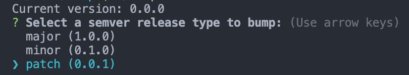

# Bump

A light wrapper around `git` and [semver](https://www.npmjs.com/package/semver) that provides a CLI utility to quickly bump the major, minor, or patch version of a git repository:

## Get It

`npm install -g gitbump`

## Use it

`cd` into a the root directory of a git repository that uses `git tag` to track version numbers, and run `bump`.